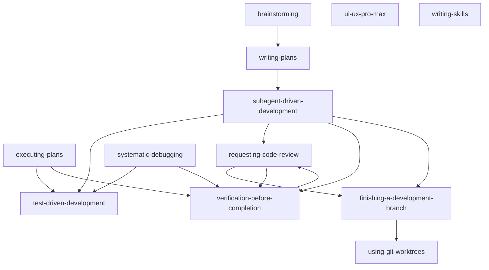

# Nexus Skill Graph

> Auto-generated by `nexus graph`. Do not edit manually.

```mermaid
graph TD
    brainstorming["brainstorming"]
    executing_plans["executing-plans"]
    finishing_a_development_branch["finishing-a-development-branch"]
    requesting_code_review["requesting-code-review"]
    subagent_driven_development["subagent-driven-development"]
    systematic_debugging["systematic-debugging"]
    test_driven_development["test-driven-development"]
    ui_ux_pro_max["ui-ux-pro-max"]
    using_git_worktrees["using-git-worktrees"]
    verification_before_completion["verification-before-completion"]
    writing_plans["writing-plans"]
    writing_skills["writing-skills"]

    brainstorming --> writing_plans
    executing_plans --> test_driven_development
    executing_plans --> verification_before_completion
    finishing_a_development_branch --> using_git_worktrees
    requesting_code_review --> finishing_a_development_branch
    requesting_code_review --> verification_before_completion
    subagent_driven_development --> test_driven_development
    subagent_driven_development --> requesting_code_review
    subagent_driven_development --> verification_before_completion
    subagent_driven_development --> finishing_a_development_branch
    systematic_debugging --> test_driven_development
    systematic_debugging --> verification_before_completion
    verification_before_completion --> requesting_code_review
    writing_plans --> subagent_driven_development
```
