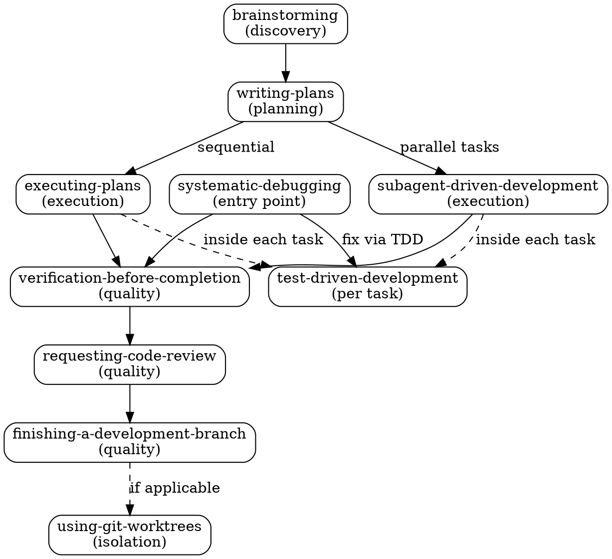

# Nexus v2 — Plugin-Based Skill System for Claude Code

> Design doc for the complete rewrite of Nexus from MCP server to native Claude Code plugin.
> Date: 2026-04-02
> Status: Draft

## 1. Purpose

Nexus v2 replaces both the current Nexus MCP server and the third-party Superpowers plugin with a single, custom skill system that:

- Uses Claude Code's native plugin mechanism (SessionStart hook + Skill tool) for reliable skill invocation
- Contains skills tailored to this server's ecosystem (OpenClaw, Finno, Harness, Obsidian)
- Requires zero runtime infrastructure (no server, no database, no embeddings)
- Provides a CLI for skill validation, sync, and graph visualization

### Why Rewrite

The current Nexus (v1) is an MCP server with PostgreSQL + pgvector + Ollama embeddings + Fastify + React dashboard. It serves ~10 Markdown files to Claude through a semantic search pipeline. The problems:

1. **Unreliable invocation** — Claude must remember to call `nexus()` before every task. It frequently doesn't.
2. **Over-engineered** — Embeddings, vector search, and a React dashboard to serve Markdown files.
3. **Weak enforcement** — Returns JSON and hopes Claude follows it. No anti-rationalization, no Iron Laws, no HARD-GATEs.
4. **Infrastructure cost** — PostgreSQL database, LaunchAgent, port 3002, Ollama dependency.

The Superpowers plugin (obra/superpowers) proves that pure Markdown skills + a SessionStart hook + strong enforcement language is the most reliable approach. Nexus v2 adopts this architecture.

## 2. Architecture

### 2.1 Project Structure

```
~/server/apps/nexus/
├── .claude-plugin/
│   └── plugin.json              # Plugin manifest for Claude Code
├── hooks/
│   ├── hooks.json               # Hook registration
│   └── session-start            # Bash script — injects using-nexus
├── skills/
│   ├── using-nexus/
│   │   └── SKILL.md             # Bootstrap (injected every session)
│   ├── brainstorming/
│   │   └── SKILL.md
│   ├── writing-plans/
│   │   └── SKILL.md
│   ├── executing-plans/
│   │   └── SKILL.md
│   ├── test-driven-development/
│   │   └── SKILL.md
│   ├── systematic-debugging/
│   │   └── SKILL.md
│   ├── verification-before-completion/
│   │   └── SKILL.md
│   ├── requesting-code-review/
│   │   └── SKILL.md
│   ├── finishing-a-development-branch/
│   │   └── SKILL.md
│   ├── subagent-driven-development/
│   │   └── SKILL.md
│   ├── using-git-worktrees/
│   │   └── SKILL.md
│   ├── writing-skills/
│   │   └── SKILL.md             # Meta-skill: how to create new skills
│   └── ui-ux-pro-max/
│       ├── SKILL.md
│       ├── data/                # 67 styles, 96 palettes, etc.
│       └── scripts/             # Python automation
├── bin/
│   └── nexus                    # CLI (Node.js, single file, zero deps)
├── specs/
│   └── skills/                  # Original skill source files (reference)
├── CLAUDE.md
└── package.json                 # Minimal: name, version, type
```

### 2.2 Plugin Manifest

`.claude-plugin/plugin.json`:

```json
{
  "name": "nexus",
  "version": "2.0.0",
  "description": "Nexus — skill-driven workflows for Claude Code",
  "skills": "./skills/",
  "hooks": "./hooks/hooks.json"
}
```

### 2.3 SessionStart Hook

`hooks/hooks.json`:

```json
[
  {
    "event": "SessionStart",
    "command": "./hooks/session-start",
    "timeout": 5000
  }
]
```

`hooks/session-start` reads `skills/using-nexus/SKILL.md` and outputs it as `additionalContext` wrapped in `<EXTREMELY_IMPORTANT>` tags. This guarantees Claude receives skill instructions at the start of every session, without the user or Claude needing to remember anything.

### 2.4 How Claude Uses Skills

```
Session starts
    ↓
SessionStart hook injects using-nexus (<EXTREMELY_IMPORTANT>)
    ↓
Claude knows it MUST invoke Skill tool before any task
    ↓
Skill tool loads SKILL.md of the relevant skill
    ↓
Claude follows instructions (Red Flags, Iron Laws, flowcharts)
    ↓
Skill indicates "REQUIRED SUB-SKILL" → Claude invokes the next
    ↓
Chain continues until terminal state
```

No intent resolver, no keyword matching, no embeddings. Claude reads the skill descriptions and decides — this is model-driven routing, the same approach used by Claude Code itself, OpenClaude, and Claw Code.

## 3. Skills

### 3.1 Skill Format

Every skill is a `SKILL.md` file with YAML frontmatter:

```markdown
---
name: skill-name
description: What the skill does (human-readable, for CLI/docs)
whenToUse: Use when [specific activation conditions — trigger only, never summary]
---

# Skill Title

<HARD-GATE> or <IRON-LAW> (at least one enforcement mechanism)

## Checklist / Process

Concrete steps. Flowcharts in Graphviz DOT for non-obvious decisions.

## Red Flags

| Thought | Reality |
Table of rationalizations Claude might use to skip, with refutations.

## Integration

REQUIRED SUB-SKILL references to chain skills.
```

Critical conventions:

- **Two-field description pattern** (inspired by OpenClaude's SkillTool). `description` is human-readable ("Explore ideas through collaborative dialogue"). `whenToUse` is model-optimized trigger ("Use when doing creative work — features, components, modifications"). The `using-nexus` bootstrap lists skills as `- nexus:name — whenToUse`. This prevents Claude from reading the description as a workflow summary and skipping the full content.
- **`whenToUse` = trigger only.** Always starts with "Use when...". Never summarizes the workflow. Max 250 characters (matches OpenClaude's skill listing budget).
- **At least one enforcement mechanism** per skill: HARD-GATE, Iron Law, or Red Flags table.
- **REQUIRED SUB-SKILL** for explicit chaining. Skills point to the next step.
- **Task checklist** — skills that have multi-step processes use "You MUST create a task for each item" to force TaskCreate usage.

### 3.2 Skill Inventory (13 skills)

#### Bootstrap

| Skill         | Description trigger                                                         |
| ------------- | --------------------------------------------------------------------------- |
| `using-nexus` | Use when starting any conversation — establishes how to find and use skills |

#### Process — Development Workflow

| Skill                            | Description trigger                                                                         | Source        |
| -------------------------------- | ------------------------------------------------------------------------------------------- | ------------- |
| `brainstorming`                  | Use when doing creative work — features, components, modifications, or behavior changes     | DB (enriched) |
| `writing-plans`                  | Use when you have a spec or requirements for a multi-step task, before touching code        | DB (enriched) |
| `executing-plans`                | Use when you have a written implementation plan to execute                                  | DB (enriched) |
| `test-driven-development`        | Use when implementing any feature or bugfix, before writing implementation code             | DB (enriched) |
| `systematic-debugging`           | Use when encountering any bug, test failure, or unexpected behavior, before proposing fixes | DB (enriched) |
| `verification-before-completion` | Use when about to claim work is complete, before committing or creating PRs                 | DB (enriched) |
| `requesting-code-review`         | Use when completing tasks or before merging to verify work meets requirements               | New           |
| `finishing-a-development-branch` | Use when implementation is complete and you need to decide how to integrate the work        | New           |
| `subagent-driven-development`    | Use when executing plans with 2+ independent tasks that can run in parallel                 | New           |
| `using-git-worktrees`            | Use when starting feature work that needs isolation from current workspace                  | New           |

#### Meta

| Skill            | Description trigger                                                             | Source |
| ---------------- | ------------------------------------------------------------------------------- | ------ |
| `writing-skills` | Use when creating new skills, editing existing skills, or verifying skills work | New    |

#### Domain

| Skill           | Description trigger                                                             | Source     |
| --------------- | ------------------------------------------------------------------------------- | ---------- |
| `ui-ux-pro-max` | Use when designing UI/UX — layouts, styles, palettes, fonts, charts, components | DB (as-is) |

### 3.3 Workflow Chain



### 3.4 Skill Content Enrichment

Skills from the database are enriched with enforcement patterns:

| Pattern                | What it does                              | Applied to                                |
| ---------------------- | ----------------------------------------- | ----------------------------------------- |
| **Iron Law**           | Absolute rule that cannot be bypassed     | TDD, debugging, verification              |
| **HARD-GATE**          | Blocks premature action                   | brainstorming, writing-plans              |
| **Red Flags table**    | Rationalizations + refutations (12+ rows) | All process skills                        |
| **Flowchart DOT**      | Visual decision flow                      | brainstorming, debugging, executing-plans |
| **REQUIRED SUB-SKILL** | Explicit chain to next skill              | All workflow skills                       |
| **Task checklist**     | Forces TaskCreate for tracking            | brainstorming, executing-plans            |

Skills that don't exist in the database (6 new skills) are written from scratch following Superpowers patterns as reference, adapted to this server's context.

### 3.5 Absorbed Skills

Two skills from the database are absorbed into other skills rather than being standalone:

| Original       | Absorbed into   | Reason                                                                                                                     |
| -------------- | --------------- | -------------------------------------------------------------------------------------------------------------------------- |
| `spec-writing` | `brainstorming` | Brainstorming already ends by writing the spec doc. Separate skill fragments the flow.                                     |
| `grill-me`     | `brainstorming` | Stress-testing is a technique used during brainstorming, not a workflow step. Referenced as optional within brainstorming. |

## 4. CLI — `bin/nexus`

Single Node.js file (~200 lines), zero external dependencies. Uses `node:fs`, `node:path`.

### 4.1 `nexus sync`

Reads `specs/skills/*.md` and generates `skills/<name>/SKILL.md` with correct frontmatter.

1. Parse each `.md` in `specs/skills/` — extract name, description from header
2. Create `skills/<name>/SKILL.md` with YAML frontmatter
3. Copy auxiliary directories if they exist (e.g., `ui-ux-pro-max/data/`, `scripts/`)
4. Report what was created/updated

### 4.2 `nexus validate`

Validates all skills follow quality standards:

| Check             | Criterion                                            | Severity                           |
| ----------------- | ---------------------------------------------------- | ---------------------------------- |
| Frontmatter       | Has `name`, `description`, and `whenToUse`           | Error                              |
| whenToUse trigger | Starts with "Use when"                               | Error                              |
| whenToUse length  | ≤ 250 characters                                     | Warning                            |
| No placeholders   | Zero "TBD", "TODO", "..." in content                 | Error                              |
| Enforcement       | At least one HARD-GATE, Iron Law, or Red Flags table | Warning (Error for process skills) |
| Chain integrity   | Referenced `nexus:<name>` skills exist in `skills/`  | Error                              |
| Bootstrap sync    | `using-nexus` lists all existing skills              | Warning                            |
| Frontmatter size  | `name` + `description` + `whenToUse` ≤ 1024 chars    | Warning                            |

Exit code 0 if no errors. Exit code 1 if any errors.

### 4.3 `nexus graph`

Generates a relationship diagram:

1. Parse all SKILL.md files
2. Extract `nexus:<name>` references and "REQUIRED SUB-SKILL" markers
3. Generate Mermaid markdown to `docs/skill-graph.md`
4. If `mmdc` (mermaid-cli) is installed, also generate SVG

## 5. Migration Plan

### 5.1 Preserve Current Code

1. Initialize git repo in `~/server/apps/nexus/` (if not already)
2. Create GitHub repo
3. Commit current state to `main`
4. Create branch `v1-mcp-server` from main — permanent snapshot of DB/MCP/dashboard version
5. Return to `main` for rewrite

### 5.2 Build Nexus v2

6. Create new structure: `.claude-plugin/`, `hooks/`, `skills/`, `bin/`
7. Write `using-nexus` bootstrap skill
8. Migrate and enrich 7 skills from database (brainstorming, writing-plans, executing-plans, tdd, debugging, verification, ui-ux-pro-max)
9. Create 5 new skills from scratch (requesting-code-review, finishing-a-development-branch, subagent-driven-development, using-git-worktrees, writing-skills). The code-review.md content from the database is merged into requesting-code-review.
10. Write CLI `bin/nexus` (sync, validate, graph)
11. Write `hooks/session-start` bash script
12. Run `nexus validate` — all green
13. Remove `server/` and `dashboard/` directories from main

### 5.3 Install and Test

14. Install plugin: `claude plugin install ~/server/apps/nexus`
15. Start a new Claude Code session — verify hook injects `using-nexus`
16. Test skill invocation: ask Claude to brainstorm something, confirm it invokes `nexus:brainstorming`
17. Verify chain: confirm brainstorming leads to writing-plans

### 5.4 Cleanup Old Infrastructure

18. Uninstall Superpowers: `claude plugin uninstall superpowers`
19. Remove MCP entry `skills` from `~/.claude/settings.json`
20. Unload and remove LaunchAgent: `launchctl unload ~/Library/LaunchAgents/dev.nexus.server.plist`
21. Drop PostgreSQL database and role: `DROP DATABASE nexus; DROP ROLE nexus;`
22. Update `~/server/CLAUDE.md`:
    - Remove Nexus MCP/dashboard/port 3002/LaunchAgent references
    - Update Nexus section to describe plugin architecture
    - Free port 3002 in port map
    - Remove `nexus` from PostgreSQL databases/users tables
    - Remove "Nexus — OBRIGATÓRIO" section (replaced by automatic hook injection)
23. Update `~/.claude/settings.json` references if any mention `superpowers:`
24. Push to GitHub

## 6. What Gets Removed

| Item                           | Current                                            | After                         |
| ------------------------------ | -------------------------------------------------- | ----------------------------- |
| Fastify HTTP server            | Running 24/7 on port 3002                          | Gone                          |
| React dashboard                | SPA with skill graph                               | Gone                          |
| PostgreSQL `nexus` DB          | pgvector, embeddings, skill_relations              | Gone                          |
| Ollama dependency              | nomic-embed-text for 768-dim embeddings            | Gone                          |
| LaunchAgent `dev.nexus.server` | Auto-start, KeepAlive                              | Gone                          |
| MCP server (stdio)             | Registered in settings.json as `skills`            | Gone                          |
| Drizzle ORM + migrations       | Schema, client, migration files                    | Gone                          |
| npm dependencies               | ~40 packages (fastify, drizzle, react, vite, etc.) | Zero                          |
| Intent resolver                | Keywords + semantic search + pgvector              | Model-driven (Claude decides) |

## 7. Success Criteria

1. **Reliable invocation** — In a new session, Claude automatically knows about skills via hook injection. No need to call any tool first.
2. **Correct chaining** — When brainstorming completes, Claude invokes writing-plans. When executing-plans completes, Claude invokes verification.
3. **Enforcement works** — Claude does not write code before design approval (brainstorming HARD-GATE). Claude does not skip tests (TDD Iron Law). Claude does not claim completion without evidence (verification Iron Law).
4. **Validation passes** — `nexus validate` returns 0 for all skills.
5. **Zero runtime** — No processes, no ports, no databases for Nexus.
6. **Old code preserved** — Branch `v1-mcp-server` exists on GitHub with full MCP/dashboard code.

## 8. Routing Insights from OpenClaude and Claw Code

Analysis of Claude Code's own SkillTool implementation (via OpenClaude fork and Claw Code Rust port) revealed patterns that strengthen Nexus v2's routing:

### 8.1 BLOCKING REQUIREMENT enforcement

OpenClaude's SkillTool prompt uses: "When a skill matches the user's request, this is a **BLOCKING REQUIREMENT**: invoke the relevant Skill tool **BEFORE generating any other response** about the task."

This is enforcement at the tool level — the model is trained to respect this phrasing. The `using-nexus` bootstrap must use both `<EXTREMELY_IMPORTANT>` (Superpowers pattern) AND "BLOCKING REQUIREMENT" (native Claude Code phrasing) for maximum compliance.

### 8.2 Two-field description pattern

OpenClaude separates `description` (human-readable) from `whenToUse` (model-optimized trigger). The skill listing combines them: `- skill-name: description - whenToUse`. This prevents Claude from reading the description as a workflow summary shortcut.

Nexus v2 adopts this with `description` + `whenToUse` in YAML frontmatter. The `using-nexus` listing uses only `whenToUse` to keep triggers concise.

### 8.3 Budget-aware listing

OpenClaude caps skill descriptions at 250 chars and allocates ~1% of context window for listings. With 13 skills, Nexus v2 is well under budget, but `nexus validate` enforces the 250-char limit on `whenToUse` as a quality guardrail.

### 8.4 What was NOT adopted

- **Tool search scoring** (Claw Code) — Point-based relevance scoring for deferred tools. Not needed because Nexus skills are always visible, not deferred.
- **Forked execution** — Skills can run in isolated sub-agents via `context: fork` in frontmatter. All Nexus v2 skills run inline by default. Documented for future use if a skill needs isolation.
- **Hierarchical discovery** (Claw Code) — Walks ancestor directories for skills. Not needed because Nexus is installed as a plugin with a fixed `skills/` directory.

## 9. Out of Scope

- Domain-specific skills (OpenClaw admin, knowledge-base, Finno) — future work via `writing-skills`
- Dynamic skill discovery via MCP — replaced by static list in `using-nexus`
- Embedding-based semantic search — replaced by Claude's native skill matching
- Dashboard or web UI of any kind
- Multi-platform support (Cursor, Codex, Gemini) — Claude Code only for now
