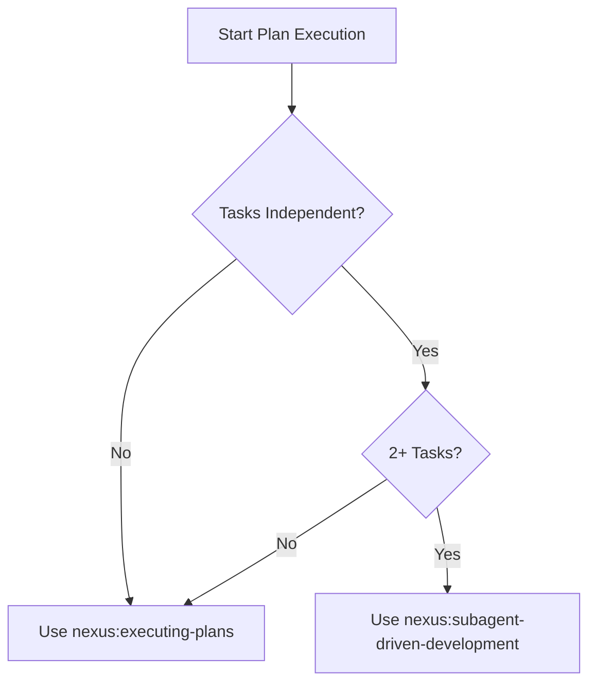
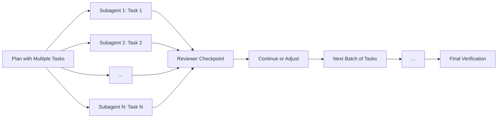

<SUBAGENT-STOP>
If you were dispatched as a subagent to execute a specific task, skip this skill.
</SUBAGENT-STOP>

## Overview

Execute implementation plans using fresh subagents per task with review checkpoints. This approach allows for parallel execution of independent tasks while maintaining quality through review checkpoints.

## SPEC_REF Input

If the input contains a `SPEC_REF:` block (output of nexus:writing-plans):

1. Read `specs/<slug>/spec.md` — pass requirements context to each subagent and reviewer
2. Read `specs/<slug>/plan.md` — source of tasks to dispatch
3. Read `specs/<slug>/tasks.md` if present — use as dispatch checklist

Include the spec path in every subagent prompt so each agent has the requirements context.

<IRON-LAW>
NO SUBAGENT EXECUTION WITHOUT REVIEW CHECKPOINTS — Every batch of tasks must be reviewed before proceeding.
</IRON-LAW>

## Decision Flowchart



## Process Diagram



## Model Selection Guidance

Choose appropriate models for different task types:

- **Cheap models (e.g., Sonnet 3.5)** for mechanical tasks:
  - Writing boilerplate code
  - Updating configuration files
  - Creating basic tests
  - Documentation updates

- **Standard models (e.g., Opus)** for integration tasks:
  - Connecting components
  - API integrations
  - Database schema changes
  - Dependency updates

- **Capable models (e.g., Haiku)** for architecture decisions:
  - System design choices
  - Complex algorithm implementations
  - Performance optimizations
  - Security considerations

## Implementer Status Handling

Subagents report status using these standardized values:

- **DONE** — Task completed successfully with all verification steps passed
- **DONE_WITH_CONCERNS** — Task completed but with identified issues that need attention
- **NEEDS_CONTEXT** — Cannot proceed without additional information from user
- **BLOCKED** — Cannot proceed due to external dependencies or obstacles

## Prompt Templates

### Subagent Template

```
You are an implementation subagent executing a single task from a larger plan. Follow the nexus:test-driven-development skill for any coding work.

Task: [TASK_DESCRIPTION]
Files involved: [FILE_LIST]
Success criteria: [SUCCESS_CRITERIA]

Follow these steps:
1. If this involves coding, use nexus:test-driven-development
2. Complete the specific task only
3. Verify completion against success criteria
4. Report status as DONE, DONE_WITH_CONCERNS, NEEDS_CONTEXT, or BLOCKED
5. Do not perform tasks outside this scope
```

### Reviewer Template

```
Review the work completed by the subagent for:

Task: [TASK_DESCRIPTION]
Work completed: [SUBAGENT_OUTPUT]

Check:
1. Does the work meet the success criteria?
2. Are there any quality issues?
3. Does it integrate properly with existing code?
4. Are there any unintended side effects?

Provide structured feedback:
- What was done well
- Issues found (with severity: Critical, Important, Minor)
- Recommendations for fixes
- Overall status: APPROVED or NEEDS_REWORK
```

## Example Workflow

1. **Task identification**: Identify independent tasks from plan
2. **Subagent dispatch**: Send each task to a separate subagent
3. **Parallel execution**: Subagents work simultaneously
4. **Checkpoint review**: Review all completed tasks together
5. **Approval/revision**: Approve or send back for revision
6. **Continue**: Move to next batch of tasks
7. **Final verification**: Complete end-to-end verification

## Advantages Over Manual Execution

- **Speed**: Parallel execution of independent tasks
- **Quality**: Dedicated focus on each task
- **Consistency**: Standardized approach across all tasks
- **Verification**: Built-in checkpoints for quality control
- **Scalability**: Can handle large plans with many tasks

## REQUIRED SUB-SKILLS

**REQUIRED SUB-SKILL:** nexus:test-driven-development (inside each task)
**REQUIRED SUB-SKILL:** nexus:requesting-code-review (after each task or batch)
**REQUIRED SUB-SKILL:** nexus:verification-before-completion (before declaring complete)
**REQUIRED SUB-SKILL:** nexus:finishing-a-development-branch (terminal state)

## Integration

This skill is typically invoked from nexus:writing-plans as an alternative to nexus:executing-plans.
