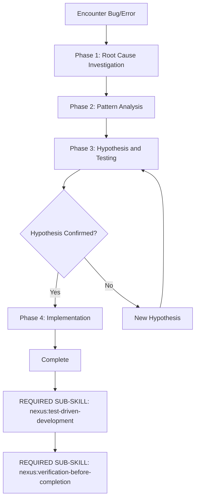

<SUBAGENT-STOP>
If you were dispatched as a subagent to execute a specific task, skip this skill.
</SUBAGENT-STOP>

<IRON-LAW>
NO FIXES WITHOUT ROOT CAUSE INVESTIGATION FIRST
</IRON-LAW>

## Overview

Four-phase debugging: root cause investigation, pattern analysis, hypothesis testing, implementation. No fixes without root cause.

Random fixes waste time and create new bugs. Quick patches mask underlying issues.

**Core principle:** ALWAYS find root cause before attempting fixes.

## The Four Phases

### Phase 1: Root Cause Investigation

**BEFORE attempting ANY fix:**

1. **Read Error Messages Carefully** — stack traces completely, line numbers, error codes
2. **Reproduce Consistently** — exact steps, every time?
3. **Check Recent Changes** — git diff, recent commits, new dependencies, config changes
4. **Gather Evidence in Multi-Component Systems** — log data at each component boundary, run once, identify WHERE it breaks
5. **Trace Data Flow** — where does bad value originate? Keep tracing up until you find the source. Fix at source, not at symptom.

### Phase 2: Pattern Analysis

1. **Find Working Examples** — similar working code in same codebase
2. **Compare Against References** — read reference implementation COMPLETELY
3. **Identify Differences** — list every difference, however small
4. **Understand Dependencies** — components, config, environment, assumptions

### Phase 3: Hypothesis and Testing

1. **Form Single Hypothesis** — "I think X is root cause because Y"
2. **Test Minimally** — SMALLEST possible change, one variable at a time
3. **Verify** — worked? → Phase 4. Didn't work? → NEW hypothesis, don't pile fixes

### Phase 4: Implementation

1. **Create Failing Test Case** — simplest reproduction, automated
2. **Implement Single Fix** — ONE change, no "while I'm here" improvements
3. **Verify Fix** — test passes, no other tests broken
4. **If 3+ fixes failed** — STOP. Question the architecture. Discuss with user before attempting more.

## Process Flow

## Red Flags — STOP and Return to Phase 1

- "Quick fix for now, investigate later"
- "Just try changing X and see"
- "I don't fully understand but this might work"
- Proposing solutions before tracing data flow
- Each fix reveals new problem in different place

## Quick Reference

| Phase             | Key Activities                                         | Success Criteria            |
| ----------------- | ------------------------------------------------------ | --------------------------- |
| 1. Root Cause     | Read errors, reproduce, check changes, gather evidence | Understand WHAT and WHY     |
| 2. Pattern        | Find working examples, compare                         | Identify differences        |
| 3. Hypothesis     | Form theory, test minimally                            | Confirmed or new hypothesis |
| 4. Implementation | Create test, fix, verify                               | Bug resolved, tests pass    |

## REQUIRED SUB-SKILLS

**REQUIRED SUB-SKILL:** nexus:test-driven-development (fix via TDD — write failing test that reproduces bug, then fix)
**REQUIRED SUB-SKILL:** nexus:verification-before-completion (verify fix doesn't break other things)

## Integration

This is an independent entry point that chains to TDD and verification skills.